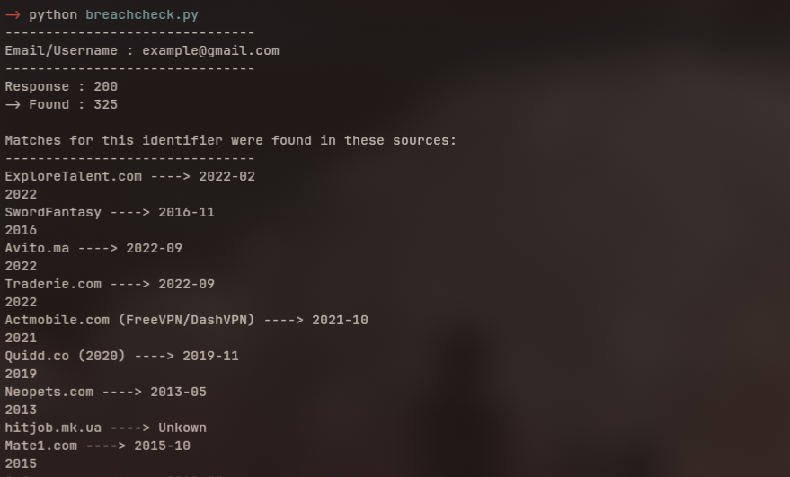
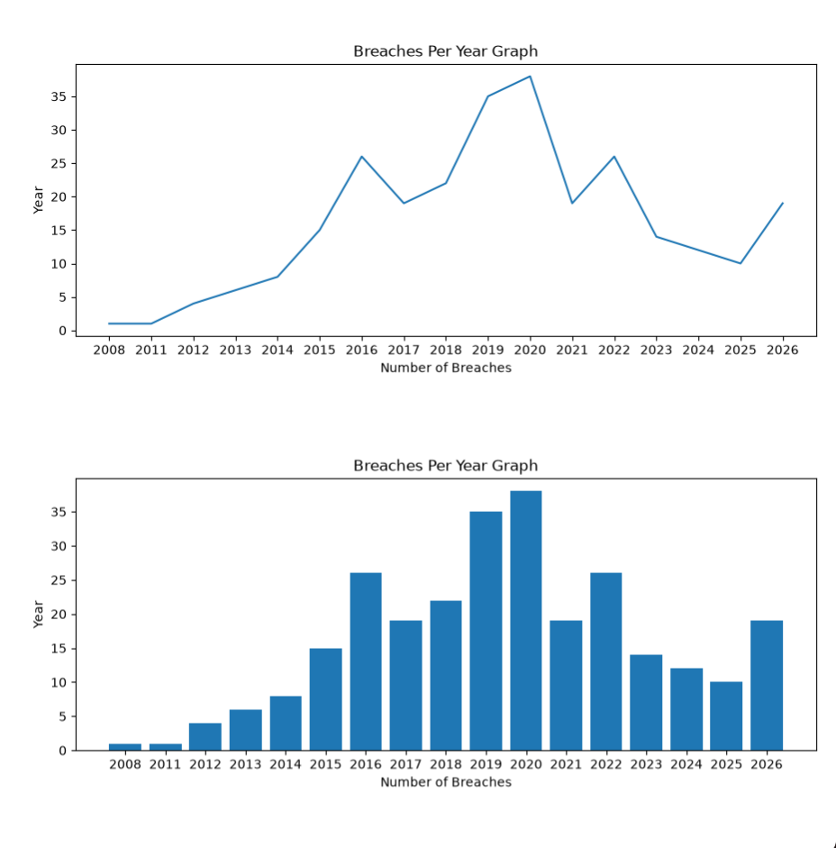

# BreachCheck

Check an email address or username against LeakCheck's public breach data, then explore the returned sources with yearly charts.

This project is only for educational purposes. The actual goal is the usage of "Requests" library to send API requests, "Matplotlib" in order to create charts/graphs.

## Features

- Look up an email address or username through the LeakCheck Public API.
- Display number of sources , their names and available dates.
- Display a line graph and a bar chart together in one figure. (breach sources per year)

## Preview

### CLI Preview



### Charts Preview



## Getting started

Install Python 3, then open a terminal in the directory containing `breachcheck.py`.

### Linux / macOS

Create a virtual environment, install the dependencies, and run the script:

```bash
python3 -m venv .venv
./.venv/bin/python -m pip install requests matplotlib
./.venv/bin/python breachcheck.py
```

### Windows (PowerShell or Command Prompt)

Create a virtual environment, install the dependencies, and run the script:

```powershell
py -3 -m venv .venv
.\.venv\Scripts\python.exe -m pip install requests matplotlib
.\.venv\Scripts\python.exe breachcheck.py
```

If `py` is not recognised, use `python -m venv .venv` for the first command, provided `python` points to your Python 3 installation.

These commands use the virtual environment's Python directly, so you do not need to activate it. After the initial setup, use only the last command for your operating system to run the project again.

### Usage

Enter an email address or username when prompted:

```text
Email/Username : user@example.com
```

## How it works

1. Read the identifier entered in the terminal.
2. Send a request to LeakCheck's public lookup endpoint.
3. Decode the JSON response into Python data structures.
4. Read the returned source names and dates.
5. Extract years from nonempty dates and count sources for each year.
6. Plot the yearly counts in two vertically stacked charts.

The request uses this endpoint:

```text
GET https://leakcheck.io/api/public?check={identifier}
```

The public API returns source information and exposed-data categories, without returning the underlying leaked values. Its documented rate limit is **one request per second**. Username queries require at least three characters. See the [official API documentation](https://docs.leakcheck.io/public-api/lookup) for current details.

## Understanding the results

The API's record count and the script's source count describe different things:

| Value | Meaning |
| --- | --- |
| HTTP status | The HTTP result of the request. |
| API `found` | The number of matching breach records reported by LeakCheck. |
| Number of returned sources | The number of entries in the response's `sources` list. This is the count displayed by the script. |
| Source date | The date supplied by LeakCheck for that source, when available. |


## Built with

- [Python](https://www.python.org/) for application logic.
- [Requests](https://requests.readthedocs.io/) for HTTP requests.
- [Matplotlib](https://matplotlib.org/) for visualization.
- [LeakCheck Public API](https://docs.leakcheck.io/public-api/lookup) for breach-source lookups.

This is an independent learning project and is not affiliated with LeakCheck.
